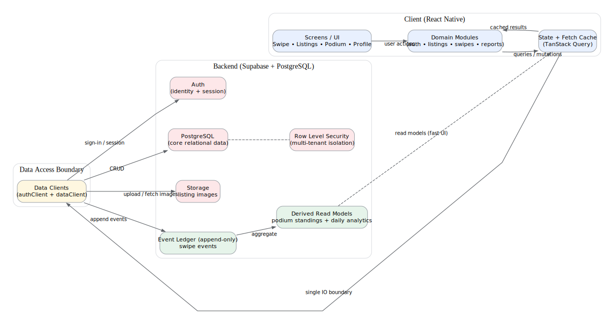

# LowBallr — Event-Sourced Marketplace (Overview)

## What LowBallr Does

LowBallr is a marketplace app built around an **event-sourced interaction ledger**. User actions are recorded as immutable events, enabling replay/auditing and powering analytics such as standings, podium rankings, and daily reports.

**Usage signal:** iOS TestFlight (10+ active testers)  
**Event volume:** 500+ event actions/day

---

## Architecture

### System Overview

---

## High-Level Components

- **React Native Mobile Client**
  - Core marketplace flows
  - Reads from derived standings/analytics views for fast UI

- **Event Ledger (Immutable)**
  - Append-only record of user interactions
  - Serves as the system of record for replay/auditing

- **Analytics + Standings Pipeline**
  - Derives daily reports and computes podium rankings from the event stream
  - Reduces on-demand recomputation in the UI by precomputing results

- **Database + Auth (Supabase / PostgreSQL)**
  - Stores ledger + projections
  - Enforces authorization at the data layer via RLS

---

## Key Engineering Decisions

### Event Sourcing
- **Immutable event ledger** preserves history of user actions for replay, auditing, and analytics
- Derived projections used for reads to keep UI fast and consistent

### Performance
- Precomputed standings + daily reports to avoid on-demand recomputation
- Designed to handle **500+ event actions/day** without UI latency spikes

### Security
- **PostgreSQL Row Level Security (RLS)** enforces multi-tenant authorization at the data layer, preventing cross-tenant access

---

## Metrics

- **Event volume:** 500+ event actions/day
- **TestFlight:** 10+ active testers
- **Analytics:** daily standings + podium rankings derived from the event ledger

---

## Contact

Riley Devitt — rileydevitt@dal.ca
